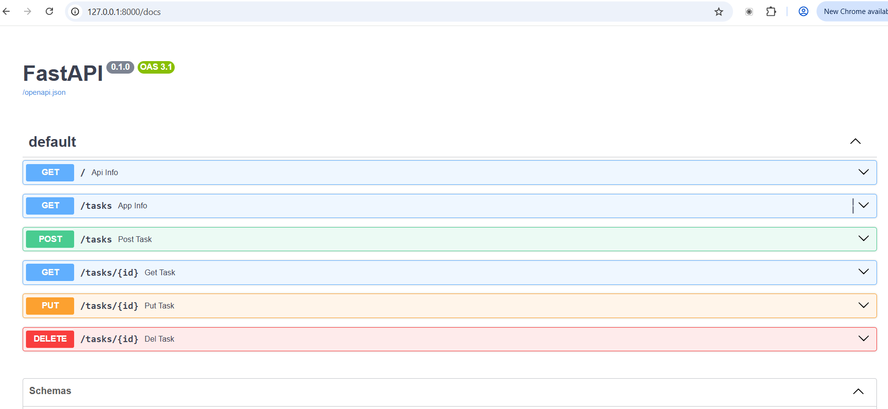
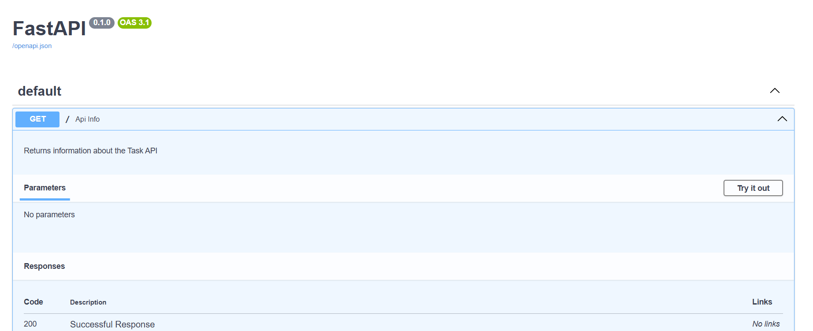
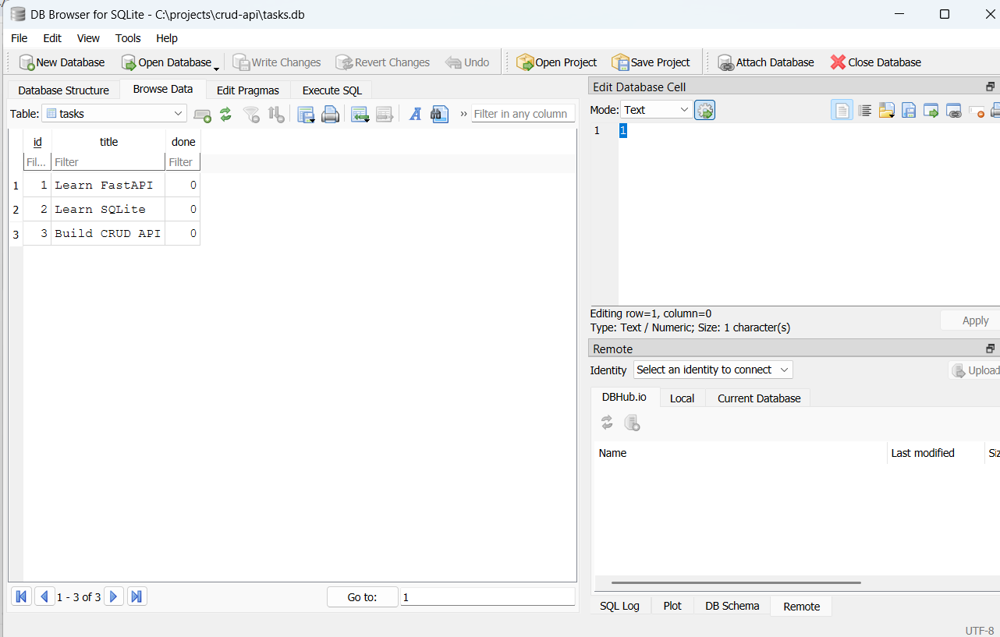

# Task API

A simple REST API built with **Python and FastAPI**

The API implements a CRUD workflow for tasks using an in-memory list of tasks.

## Requirements

- Python 3.x
- FastAPI
- Uvicorn

## Installation & Running

Clone the repository and navigate into the project:

```bash
cd /c/projects/crud-api
```

Install FastAPI:

```bash
python -m pip install "fastapi[standard]"
```

Start the server:

```bash
python -m fastapi dev main.py
```

The API will be available at:

```text
http://localhost:8000
```

Interactive Swagger documentation is available at:

```text
http://localhost:8000/docs
```

## API Endpoints

| Method | Endpoint | Description | Success |
|---|---|---|---|
| GET | `/` | Returns information about the API | 200 |
| GET | `/health` | Checks whether the server is running | 200 |
| GET | `/tasks` | Returns all tasks | 200 |
| GET | `/tasks/{id}` | Returns one task by ID | 200 |
| POST | `/tasks` | Creates a new task | 201 |
| PUT | `/tasks/{id}` | Updates an existing task | 200 |
| DELETE | `/tasks/{id}` | Deletes a task by ID | 204 |

## Example Task

```json
{
  "id": 1,
  "title": "Learn FastAPI",
  "done": false
}
```

## API Examples

### GET `/`

Returns information about the API.

```bash
curl -i http://localhost:8000/
```

Expected response:

```text
HTTP/1.1 200 OK
```

```json
{
  "name": "Task API",
  "version": "1.0",
  "endpoints": ["/tasks"]
}
```

### GET `/health`

Checks whether the server is alive.

```bash
curl -i http://localhost:8000/health
```

Expected response:

```text
HTTP/1.1 200 OK
```

```json
{
  "status": "ok"
}
```

### GET `/tasks`

Returns the complete task list.

```bash
curl -i http://localhost:8000/tasks
```

### GET `/tasks/{id}`

Returns one task.

```bash
curl -i http://localhost:8000/tasks/1
```

If the task does not exist, the API returns `404`.

Example:

```bash
curl -i http://localhost:8000/tasks/99
```

Expected JSON error:

```json
{
  "detail": "Task 99 not found"
}
```

### POST `/tasks`

Creates a new task.

Request:

```bash
curl -i -X POST http://localhost:8000/tasks -H "Content-Type: application/json" -d '{"title":"Buy milk"}'
```

The server creates the next available ID and sets `done` to `false`.

Expected status:

```text
201 Created
```

Example response:

```json
{
  "id": 4,
  "title": "Buy milk",
  "done": false
}
```

If the title is missing or empty, the server returns `400 Bad Request`.

### PUT `/tasks/{id}`

Updates an existing task.

Example:

```bash
curl -i -X PUT http://localhost:8000/tasks/1 -H "Content-Type: application/json" -d '{"title":"Buy milk and bread","done":true}'
```

The updated task is returned with status `200`.

Unknown task IDs return `404`.

### DELETE `/tasks/{id}`

Deletes an existing task.

Example:

```bash
curl -i -X DELETE http://localhost:8000/tasks/1
```

A successful deletion returns:

```text
204 No Content
```

with an empty response body.

If the task does not exist, the API returns `404`.

## CRUD Workflow

The API supports the complete CRUD cycle:

1. **Create** — `POST /tasks`
2. **Read** — `GET /tasks` and `GET /tasks/{id}`
3. **Update** — `PUT /tasks/{id}`
4. **Delete** — `DELETE /tasks/{id}`

Tasks are stored in an in-memory Python list, so the data resets when the server restarts.

## Swagger UI

FastAPI automatically generates interactive API documentation using OpenAPI.

Open:

```text
http://localhost:8000/docs
```

Swagger UI can be used to test the complete CRUD workflow without using `curl`.

### Swagger Screenshot




## FastAPI CRUD API with SQLite
A simple CRUD API built with FastAPI and SQLite. The project allows users to create, read, update, and delete tasks.

### Requirement: Install SQLModel

```text
pip install sqlmodel
```


### Database

This project uses SQLite as the database.

SQLite was chosen because it is lightweight, requires no separate database server, and stores the entire database in a single file.

The database file is:

```text
tasks.db
```


It is stored in the root directory of the project.

The tasks.db file is not committed to GitHub. It is automatically created when the application starts.

### Database Structure

The application creates a tasks table with the following columns:


| Field   | Data Type | Constraints                 | Description                             |
| ------- | --------- | --------------------------- | --------------------------------------- |
| `id`    | INTEGER   | Primary Key, Auto-increment | Unique identifier for each task         |
| `title` | TEXT      | NOT NULL                    | Title of the task        |
| `done`  | BOOLEAN   | Default: `False`            | If the task is completed |


### SQLite Database Viewer

The database was inspected using DB Browser for SQLite.


